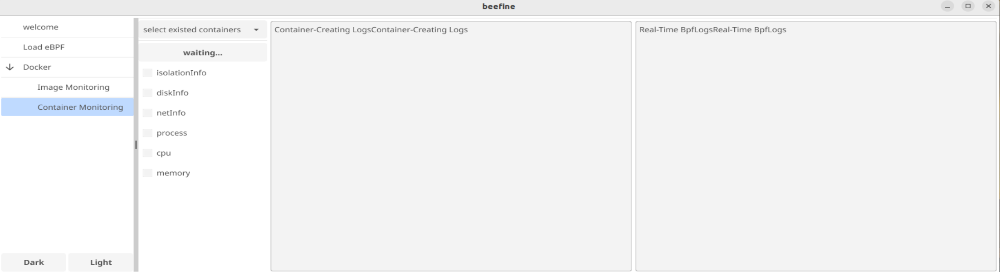

# beefine: Visualizing Docker Internals with eBPF
## 2024年全国大学生计算机系统能力大赛-操作系统赛（华东区域赛）-OS应用开发赛

## 项目简介
**Beefine** 是一个基于 **Fyne** 和 **Cilium eBPF** 框架开发的工具，旨在通过图形化交互界面（GUI）实时观测 Docker 容器的创建过程，深入理解虚拟化技术的核心理念和实现原理。本项目同时支持加载和管理 eBPF 程序，帮助用户追踪操作系统在 Docker 操作中的行为，后续将扩展到 Kubernetes 集群的 Pod 监控。

---

## 创建初衷

容器化技术已经成为现代软件开发和部署的核心工具，而 Docker 是其中的代表。然而，在使用容器时，很多开发者并不清楚容器创建的具体过程，例如操作系统如何处理镜像解压、文件系统挂载和网络隔离等底层细节。
而docker-swarm和kubernetes等等容器编排系统更是让现在应用系统中的容器数量激增，而理解其中的最小单元pod更加需要理解pod中的容器通信方式\
为了帮助开发者更直观地理解这些细节，**Beefine** 通过 eBPF 技术捕获和分析容器的系统调用行为，并借助 Fyne 提供图形化的实时反馈，最终实现以下目标：

1. **简化学习过程**：
    - 通过实时观测容器创建过程，帮助开发者更好地理解容器镜像，虚拟化技术。
2. **提高可视化交互体验**：
    - 提供直观的图形界面，展示关键的系统行为和资源变化。
    - 配置了动态加载bpf程序的入口，让使用者快速实践bpf
3. **开发工具化**：
    - 为学习者和工程师提供一个可以随时实验和验证的工具，减少操作系统实验的门槛。
---

## 项目用途
该项目目前专注于**实时观测**场景 ：
1. **Docker容器创建观测**：
    - 实时加载 eBPF 程序，捕获 Docker 使用镜像创建容器时的操作系统行为。
    - 包括镜像拉取、文件系统设置、命名空间管理、网络配置等。
    - 为学习者和开发者提供实验环境，用于理解容器的实现原理，如Namespace、Cgroup 和 UnionFS。
2. **Docker容器运行时**
    - 实时的容器所处namespace和cgroup信息展示以及设置
    - 动态加载xdp程序管理分析容器网络中的数据包
    - 动态观测容器中的进程信息
3. **动态 eBPF 程序管理**：
    - 提供直观界面加载和管理 eBPF 程序，动态分析系统行为。
4. **图形化分析**：
    - 使用 Fyne 提供直观、易用的 GUI，通过 GUI 展示分析结果，帮助用户直观理解容器的底层运行机制。
5. **未来扩展**：
    - 为 Kubernetes 集群提供监控支持，观测 Pod 的创建、调度和运行。

---

## 项目进度

### 已实现功能

1. **Docker 创建过程观测**：
    - 使用 eBPF 追踪操作系统调用，捕获 Docker 使用镜像创建容器的全过程。
2. **图形化界面**：
    - 使用 Fyne 开发可交互的 GUI，包括日志查看、动态程序加载等功能。
3. **实时 eBPF 程序加载**：
    - 支持用户加载自定义 eBPF 程序，动态分析特定行为。

### 待开发功能

1. **Kubernetes 集群观测**：
    - 设计用于追踪 Kubernetes Pod 调度与运行的功能模块。
2. **镜像与容器的性能分析**：
    - 提供更多统计功能，分析资源使用情况（CPU、内存、I/O 等）。
3. **历史数据管理**：
    - 支持保存和回放观测结果，便于后续分析。
4. **优化 GUI**：
    - 增加更多交互功能，例如高级过滤、实时图表更新。

### 当前开发进度

1. **功能模块**：

    - [X]  图形界面搭建（基于 Fyne）
    - [X]  支持动态加载 eBPF 程序
    - [X]  基础的 Docker 行为观测功能（镜像拉取、容器创建）
    - [ ]  数据可视化（实时图表展示系统调用频率）
    - [ ]  丰富的日志和分析工具
2. **观测重点**：

    - Docker 使用镜像创建容器的全过程：
        - [X] 镜像文件的拉取与解压。
        - [X] 文件系统的挂载（OverlayFS）。
        - [X] 容器隔离环境的设置（Namespace 和 Cgroup）。

- Docker 容器运行中的性能观测

    - [X] 隔离文件信息
    - [X] 挂载磁盘信息
    - [X] 网络信息
    - [X] 进程信息
    - [X] cpu信息
    - [X] memory信息
- 后续计划扩展到更多场景，包括：
    - [ ] 容器运行时的性能分析。
    - [ ] Kubernetes 集群中的容器行为观测。

---
## 文件结构
├── bpf/                     # 主程序入口 <br>
│   ├──*/                    # bpf2go与libbpf结合bpf程序 <br>
│   └──vmlinux.h             # bpf 的 btf文件 ` `<br>
├── pkg/                     # 可以导出的包,提供可以复用的组件和逻辑代码 ` `<br>
│   │── gui/                 # Fyne GUI 相关代码 ` `<br>
│   │  ├── themes/           # 存放fyneUI 设计的功能代码 ` `<br>
│   │  └── watcher/          # Docker 功能界面 ` `<br>
│   └── component/           # 存放自定义的的fyne组件 ` `<br>
├── internal/                # Docker 操作工具 ` `<br>
│   ├── cli/                 # Docker以及脚本交互管理 ` `<br>
│   ├── data/                # fyne资源管理 ` `<br>
│   └── helper               # 通用辅助函数 ` `<br>
├── configs/                 # 项目配置  ` `<br>
├── scripts/                 # 存放脚本文件 ` `<br>
├── test/                    # 存放测试用例以及脚本 ` ` <br>
├── main.go                  # GO 程序入口 <br>
├── go.mod                   # Go 模块文件 ` ` <br>
├── makefile                 # 项目编译脚本 <br>
├── license                  # 证书文件 <br>
└── README.md                # 项目文档 ` <br>
---
## 模块说明
### Load eBPF 模块
    
提供了几个基础的bpf程序，可以供使用者载入，了解ebpf程序的运行效果
包括功能：
- 展示系统中可用的bpf帮助函数，为初学者提供开发上的帮助
- 选择网卡接口，实时获取经过网卡的数据计数，并展示部分报文信息

- 载入ebpf程序监测系统中的exec系统调用，在入口和出口处都设置了钩子函数，实时展示系统中运行和退出的程序


### Docker DashBoard 
展示系统中的docker daemon实时的使用情况，提供功能便于使用者了解docker运行的整体情况
实现重点：获取系统中的容器和镜像数量，以及统计所有运行中的容器对系统cpu和memory资源的使用情况


### Docker-image monitor模块

该模块聚焦于观测docker基于image创建容器的全过程，聚合了docker 对image的管理能力，可以输入image name 拉取image，拉取选择系统中存在的镜像，右侧的看板会展示当前镜像创建的过程日志 \
实现重点：通过日志还原docker解析image创建容器的过程\
镜像解析：镜像格式遵守OCI镜像规范定义，包含镜像索引，镜像清单，镜像层以及镜像配置。镜像索引用以区分镜像的不同架构平台，镜像清单中包含了镜像具体内容的哈希摘要，提供了获取镜像的寻址方式，提取镜像层信息的方法，因此主要涉及的系统调用就是openat，read，write等fs接口，docker的容器文件系统采用的是unionfs，容器最初只有一层rootfs，解析镜像层文件中的每一层都会往rootfs上覆盖新的一层，而镜像配置则主要包含了镜像中的环境变量，执行参数，存储卷等信息，docker会通过镜像配置中的内容得到对应的OCI runtime bundle启动容器\
创新点：实现对VFS，挂载，网络和隔离api的bpf观测程序交互式地载入策略，可以允许使用者按需获取镜像加载数据
### Docker-container monitor模块

该模块聚焦于运行中的容器的实时数据分析，OCI运行时规范规定了容器的运行状态，该模块主要观测的是出于stopped和running状态的容器，对于running状态的容器可以观测到更多有关的数据，容器本身的隔离使用了namespace和cgroup等等linux 容器技术，docker 则是通过容器运行时来管理容器
实现重点：分析容器的namespace以及cgroup信息
创新点：实时获取同一namespace中的peer信息，以pid namespace为例，实现了实时获取容器中新增运行进程信息的展示，减少容器外信息的干扰，其他的namespace空间也类似
## 快速开始文档

### 0.系统要求

- **操作系统**：Ubuntu 20.04 或更高版本
- **架构**：AMD64
- **依赖工具**：
    - **Go**：版本 >= 1.18
    - **Docker**：需要 Docker Daemon 运行
    - **X11 开发库**
    - **bpftool,bpftrace工具"
    - **权限**：eBPF 程序需要管理员权限运行

---

### 1. 编译源码

以下是编译源码的方法，适用于开发者或需要自定义功能的用户。

#### 安装依赖

在编译源码前，请确保系统已安装以下依赖：

1. **安装 Go** 如果未安装 Go，可以通过以下命令安装：
```bash
sudo apt update 
sudo apt install -y golang gcc
```
2. 检查安装是否成功：确保版本 >= 1.18
```bash 
go version
```
**安装 Docker** 如果未安装 Docker，可以参考以下命令安装：
```bash
 sudo apt update sudo apt install -y docker.io && sudo usermod -aG docker ${USER} && sudo systemctl enable --now docker
```
**确保管理员权限** eBPF 程序需要管理员权限，确保当前用户在 `sudo` 或 `root` 下运行。
3. 安装X11开发库以及fyne依赖库
```bash
sudo apt install libx11-dev libx11-xcb-dev libgl1-mesa-dev xorg-dev build-essential pkg-config
4. bpftrace安装
https://github.com/bpftrace/bpftrace/blob/master/INSTALL.md
5.bpftool安装
https://github.com/libbpf/bpftool/releases
```
### 克隆项目源码
```
git clone https://github.com/shoggothforever/beefine.git
cd beefine 
go mod tidy // 安装必要的golang 依赖库
```
### 编译程序
可选项：在源码bpf目录下添加自定义的bpf程序
对于每个bpf程序，定义一个bpfxxx.go文件作为用户态处理程序，一个bpfxxx.c文件作为内核态程序，结合bpf2go与libbpf实现自定义bpf程序\
```make gen PKG=$(yourBpfProgramName)```\
参考项目makefile直接编译源码：
```编译可执行文件 make build ```

如果没有改动bpf程序，可以使用以下命令：
`go build -ldflags "-s -w" -o beefine`
### 运行程序
编译成功后，执行以下命令运行：
`sudo ./beefine`
程序将启动图形化界面。
### 打包程序
具体参考fyne官网 [Compiling for different platforms](https://docs.fyne.io/started/cross-compiling)
```
make package linux # GOOS=linux GOARCH=amd64
make package macos # GOOS=darwin GOARCH=amd64
make package windows # GOOS=windows GOARCH=amd64
```

---

## 2. 运行二进制应用

以下是直接运行已编译二进制文件的方法，适用于不需要修改源码的用户。

### 下载二进制文件

从项目的 [Release 页面](https://github.com/shoggothforever/beefine/releases) 下载对应版本的二进制文件。

以 Ubuntu 20.04 为例：

``` bash
wget https://github.com/shoggothforever/beefine/releases/download/v1.0.0/beefine-linux-amd64 -O beefine
chmod +x beefine
```
### 安装依赖

确保以下依赖已安装：

1. **Docker**： 安装命令参考上述 **编译源码** 部分。
2. **X11图形库** 安装命令参考上述 **编译源码** 部分。
2. **权限设置**： 确保当前用户拥有运行 eBPF 程序的权限。

### 运行程序

运行以下命令启动程序：

`sudo ./beefine`


## 使用方法

### 1. 加载 eBPF 程序
在 GUI 中选择 `Load eBPF` 功能，选择其中的一个bpf程序点击后会自动加载运行，然后会将观测到的数据返回到界面

### 2. 观测 Docker 使用资源情况
在 GUI 中选择 `Docker`，查看当前系统中的docker资源使用情况


### 3. 观测Docker 创建容器过程中行为
   a. 拉取docker image\
   b. 从系统中选择已有的docker image\
   c. 勾选bpf观测选项\
   d. 输入容器运行配置参数\
   e. 运行容器，在右侧bpf日志面板查看具体的docker操作信息

### 4. 观测docker container的实时数据
   a. 选择系统中存在的 docker container\
   b. 调整容器运行状态(running/waiting/exited)\
   c. 勾选观测选项
   - isolation:查看container的namespace和cgroup的信息
   - diskInfo:查看container的挂载卷信息
   - netInfo:查看container的网络信息以及加载bpf程序检测所处网络空间中的连接信息
   - process:查看process的进程组信息，并且实时观测当前容器所处pid namespaces下的其它进程的信息


---

## 未来计划

1. **Kubernetes 支持**：
    - 增加对 Kubernetes 集群中 Pod 创建过程的监控功能。
2. **实时性能监控**：
    - 使用 eBPF 追踪资源使用（CPU、内存、网络流量等），分析容器性能。
3. **数据可视化**：
    - 增加更多实时图表和分析报告，提升用户体验。
4. **跨平台支持**：
    - 提供更多平台的支持，兼容 Windows 和 macOS。
5. **支持ssh连接到远程主机观测容器信息**
---

## 参考项目
[ebpf开发教程 eunomia-bpf](https://github.com/eunomia-bpf/bpf-developer-tutorial/tree/main)\
[eXpress Data Path program written tutor](https://github.com/xdp-project/xdp-tutorial/tree/master)\
[bpf程序代码风格参考-1 cilium](https://github.com/cilium/cilium/tree/main/bpf)\
[bpf程序代码风格参考-2 linux源码中的bpf程序以及linux源码](https://elixir.bootlin.com/linux/v6.11.5/source/samples/bpf)\
[基于libbpf的bpf程序编程入门 libbpf-bootstrap](https://github.com/libbpf/libbpf-bootstrap/tree/master/examples)\
[libbpf-api](https://libbpf.readthedocs.io/en/latest/api.html)\
[fyne图形界面设计参考](https://github.com/fyne-io/fyne/tree/master/cmd/fyne_demo)\
[cilium框架官方文档](https://docs.cilium.io/en/stable/network/clustermesh/)\
[bpf verifier rules](https://www.kernel.org/doc/html/latest/bpf/verifier.html)\
[ebpf可视化项目参考](https://github.com/linuxkerneltravel/lmp/tree/develop/eBPF_Visualization)\
[bpftrace 脚本参考](https://github.com/bpftrace/bpftrace/tree/master/tools)
## 开源协议
本项目采用 [MIT License](https://opensource.org/licenses/MIT) 开源协议，详情请参见 LICENSE 文件。
