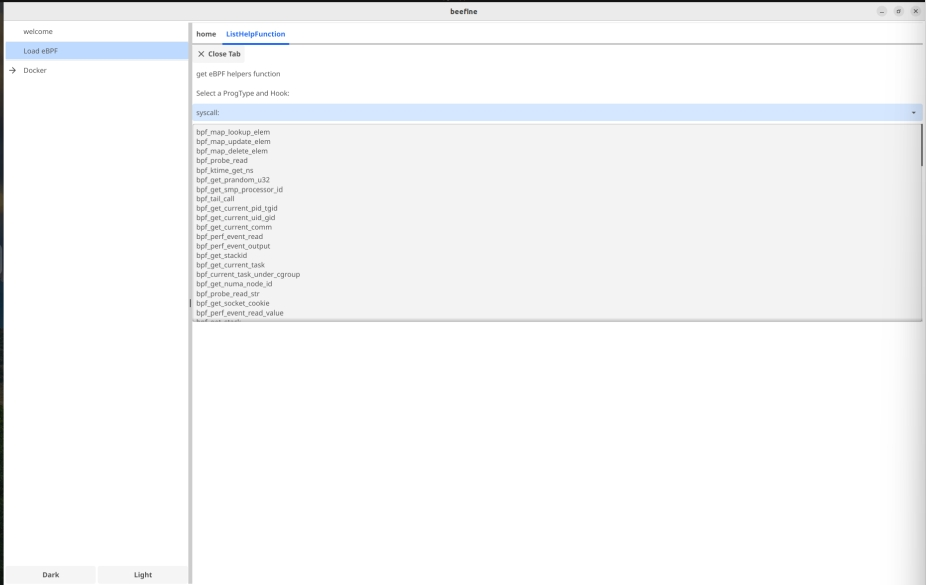
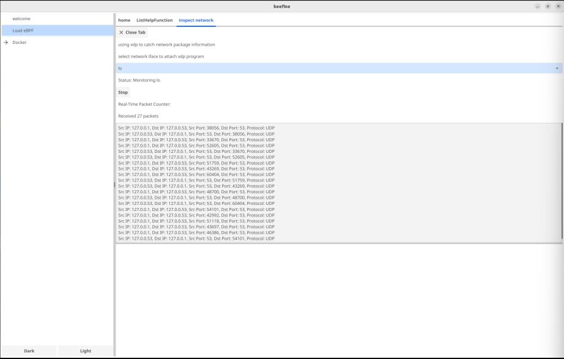
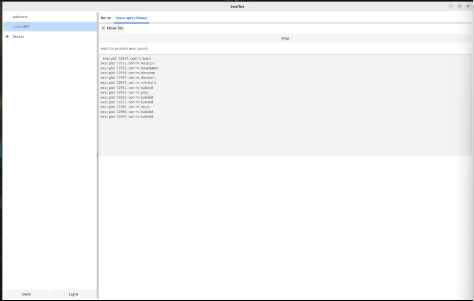
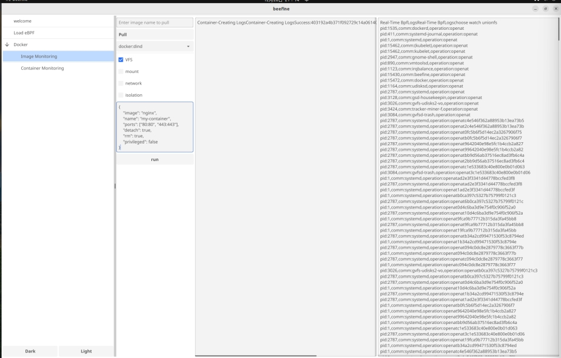
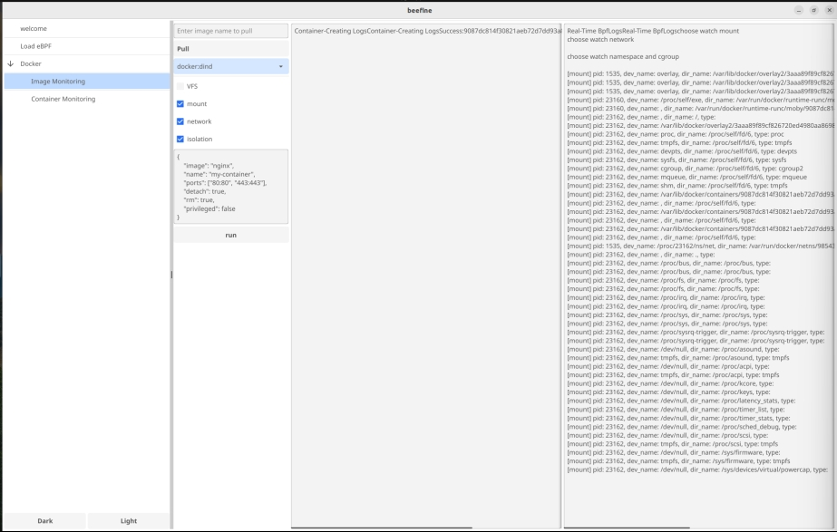
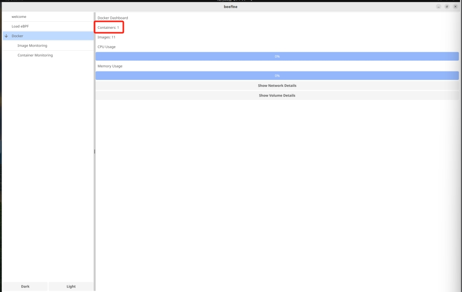
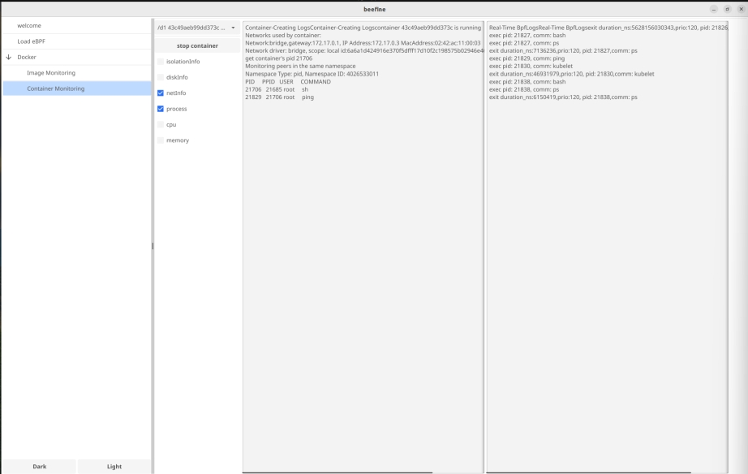

# 概述
## 项目背景
随着容器化技术在现代软件开发和部署中的广泛应用，Docker 作为其代表性工具，已经成为开发者和运维人员的核心选择。然而，尽管容器技术极大地简化了应用的部署和管理，许多开发者对容器创建过程中的底层机制仍缺乏深入了解。例如，操作系统在处理镜像解压、文件系统挂载、网络隔离等关键步骤时的具体实现细节，往往不为人知。此外，随着 Docker Swarm 和 Kubernetes 等容器编排系统的普及，应用系统中的容器数量急剧增加，理解单个 Pod 中容器的通信方式和最小单元显得尤为重要。

为了填补这一空白，Beefine 项目应运而生。

## 项目简介
Beefine 是一个基于 Fyne 和 Cilium eBPF 框架开发的工具，旨在通过图形化交互界面（GUI）实时监控 Docker 容器的创建过程，帮助用户深入理解虚拟化技术的核心理念和实现原理。项目不仅支持加载和管理 eBPF 程序，追踪操作系统在 Docker 操作中的行为，还计划在未来扩展到 Kubernetes 集群的 Pod 监控，为用户提供更加全面的容器化技术洞察。

Beefine 通过 eBPF 技术捕获和分析容器的系统调用行为，并借助 Fyne 提供图形化的实时反馈，最终实现以下目标：

简化学习过程：通过实时观测容器创建过程，帮助开发者更好地理解容器镜像，虚拟化技术。

提高可视化交互体验： 提供直观的图形界面，展示关键的系统行为和资源变化；配置了动态加载bpf程序的入口，让使用者快速实践bpf。

开发工具化：为学习者和工程师提供一个可以随时实验和验证的工具，减少操作系统实验的门槛。

## 项目应用场景
该项目目前专注于实时观测场景：

观测Docker容器的创建：Beefine 通过实时加载 eBPF 程序，从而全面捕捉 Docker 使用镜像创建容器时的操作系统行为。通过详细记录和分析在容器创建过程中的镜像拉取、文件系统设置、命名空间管理和网络配置等多个关键步骤，Beefine 为学习者和开发者提供了一个能够帮助他们深入理解容器核心机制的实验环境，从而提升其对容器技术的掌握和应用能力。

观测Docker容器的运行：在容器运行阶段，Beefine 实时展示容器所处的命名空间（namespace）和控制组（cgroup）信息，并允许用户进行相应的设置。通过动态加载 XDP 程序，有效管理和分析容器网络中的数据包，确保网络通信的高效与安全。同时还支持动态观测容器内的进程信息，使用户能够实时监控容器内运行的各类进程，及时发现和解决潜在的问题，从而优化容器的运行性能和稳定性。

管理动态 eBPF 程序：Beefine 提供了一个直观的界面，允许用户轻松加载和管理 eBPF 程序，使得用户能够根据具体需求动态分析系统行为，灵活应对不同的监控和调试场景。通过简化 eBPF 程序的管理过程，Beefine 大大提升了用户在系统行为分析和性能调优方面的效率，使开发者和运维人员能够更加专注于核心任务，减少了复杂配置和操作的时间成本。

# 项目开发进度
### 已实现功能

1. **Docker 创建过程观测**：
    - 使用 eBPF 追踪操作系统调用，捕获 Docker 使用镜像创建容器的全过程。
2. **图形化界面**：
    - 使用 Fyne 开发可交互的 GUI，包括日志查看、动态程序加载等功能。
3. **实时 eBPF 程序加载**：
    - 支持用户加载自定义 eBPF 程序，动态分析特定行为。

### 待开发功能

1. **Kubernetes 集群观测**：
    - 设计用于追踪 Kubernetes Pod 调度与运行的功能模块。
2. **镜像与容器的性能分析**：
    - 提供更多统计功能，分析资源使用情况（CPU、内存、I/O 等）。
3. **历史数据管理**：
    - 支持保存和回放观测结果，便于后续分析。
4. **优化 GUI**：
    - 增加更多交互功能，例如高级过滤、实时图表更新。

### 当前开发进度

1. **功能模块**：

    - [X]  图形界面搭建（基于 Fyne）
    - [X]  支持动态加载 eBPF 程序
    - [X]  基础的 Docker 行为观测功能（镜像拉取、容器创建）
    - [ ]  数据可视化（实时图表展示系统调用频率）
    - [ ]  丰富的日志和分析工具
2. **观测重点**：

    - Docker 使用镜像创建容器的全过程：
        - [X] 镜像文件的拉取与解压。
        - [X] 文件系统的挂载（OverlayFS）。
        - [X] 容器隔离环境的设置（Namespace 和 Cgroup）。

- Docker 容器运行中的性能观测

    - [X] 隔离文件信息
    - [X] 挂载磁盘信息
    - [X] 网络信息
    - [X] 进程信息
    - [X] cpu信息
    - [X] memory信息
- 后续计划扩展到更多场景，包括：
    - [ ] 容器运行时的性能分析。
    - [ ] Kubernetes 集群中的容器行为观测。

# 整体框架及功能模块设计
待填入

# 项目创新点
待填入

# 项目测试与分析
## Load eBPF模块测试
点击应用左侧Load eBPF选项卡进入home界面
### ListHelpFunction功能测试
在home界面下点击ListHelpFunction按钮进入子界面，点击下拉选择框，选择syscall:选项，可发现应用展示出了syscall下的所有bpf帮助函数，同时支持复制等操作

点击Close Tab按钮返回home界面

### InspectNetwork功能测试
在home界面下点击InspectNetwork按钮进入InspectNetwork子界面，点击下拉选择框，选择想要追踪的网络，应用自动开始抓取数据报文。

打开终端，输入ping www.baidu.com 命令，发现应用显示出了数据包数量和部分报文数据，同时再进行定时数据更新。

点击Stop按钮，结束网络数据抓包，点击Close Tab按钮返回home界面

### TraceSyscall/Exec功能测试
在home界面下点击TraceSyscall/Exec按钮进入TraceSyscall/Exec子界面，应用自动开始抓取调用的系统调用。

打开终端，输入命令ping www.baidu.com 命令和sleep 10命令，发现应用中已经有若干条系统调用被展示出来

点击Stop按钮，结束系统调用抓包，点击Close Tab按钮返回home界面

## Docker模块测试
点击应用左侧Docker选项卡，展开Docker模块功能，同事应用进入DockerDashboard界面，展示系统中的容器和镜像数量，以及统计所有运行中的容器对系统cpu和memory资源的使用情况

### ImageMonitoring功能测试
点击应用左侧ImageMonitoring选项卡，进入ImageMonitoring子界面，点击SelectExistedImage下拉选项框，选择docker:dind，选择想要显示的信息，选中对应复选框，点击Run按钮，即可创建一个Docker
返回DockerDashboard界面，发现新创建的Docker已被显示出来

### ContainerMonitoring功能测试
点击应用左侧ContainerMonitoring选项卡，进入ContainerMonitoring子界面，点击下拉选择框，选中一个正在运行的容器，在终端中进入这个容器的交互式Shell，选中任意复选框，可在左侧输出框中输出可复制的容器的相关信息；选中netinfo和process复选框，在终端进入容器输入相关命令（例如ping命令），应用右侧输出框输出相关信息

# 项目管理与团队管理

# 总结与展望
本项目自立项到目前已有一个多月的时间，在这一个多月的时间里，团队共向gitlab仓库推送50余次，更新文档10余版，通过该项目，团队对eBPF的了解与掌握程度有了可观的提升。值得欣慰的是，本项目圆满完成了立项时所预定的目标，在简化学习过程、提高可视化交互体验、开发工具化等方面取得了预期成果，同时，通过规范化编程，我们设置了许多可拓展模块，使用者可根据自身学习情况定制化自己的软件体验，这无疑有助于未来的操作系统教学与实践。See Unknown,Conquer Unknown,我们很开心能够为这一空白添砖加瓦。

在Beefine的开发过程中，我们参考了许多优秀的开源项目，例如XXXXX，在这里，谨向这些伟大的开发团队表达我们诚挚的感谢。

一个月的时间可以成熟一个人的技术，但绝不会让一个应用变得完美。在未来，团队还将致力于丰富优化本项目，例如增加对Kubernetes的支持、引入实时性能监控、对远程主机的支持、优化可视化体验，引入实时更新图表与分析报告以及对Windows、MacOS的支持和对OpenEuler等国产操作系统的专门优化，
# 参考文献与项目
[ebpf开发教程 eunomia-bpf](https://github.com/eunomia-bpf/bpf-developer-tutorial/tree/main)\
[eXpress Data Path program written tutor](https://github.com/xdp-project/xdp-tutorial/tree/master)\
[bpf程序代码风格参考-1 cilium](https://github.com/cilium/cilium/tree/main/bpf)\
[bpf程序代码风格参考-2 linux源码中的bpf程序以及linux源码](https://elixir.bootlin.com/linux/v6.11.5/source/samples/bpf)\
[基于libbpf的bpf程序编程入门 libbpf-bootstrap](https://github.com/libbpf/libbpf-bootstrap/tree/master/examples)\
[libbpf-api](https://libbpf.readthedocs.io/en/latest/api.html)\
[fyne图形界面设计参考](https://github.com/fyne-io/fyne/tree/master/cmd/fyne_demo)\
[cilium框架官方文档](https://docs.cilium.io/en/stable/network/clustermesh/)\
[bpf verifier rules](https://www.kernel.org/doc/html/latest/bpf/verifier.html)\
[ebpf可视化项目参考](https://github.com/linuxkerneltravel/lmp/tree/develop/eBPF_Visualization)\
[bpftrace 脚本参考](https://github.com/bpftrace/bpftrace/tree/master/tools)
