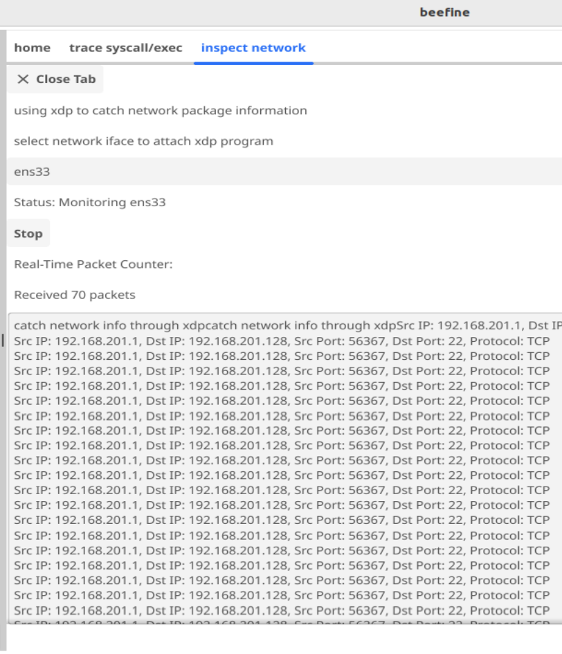
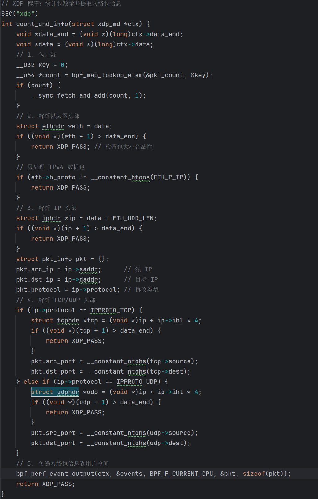
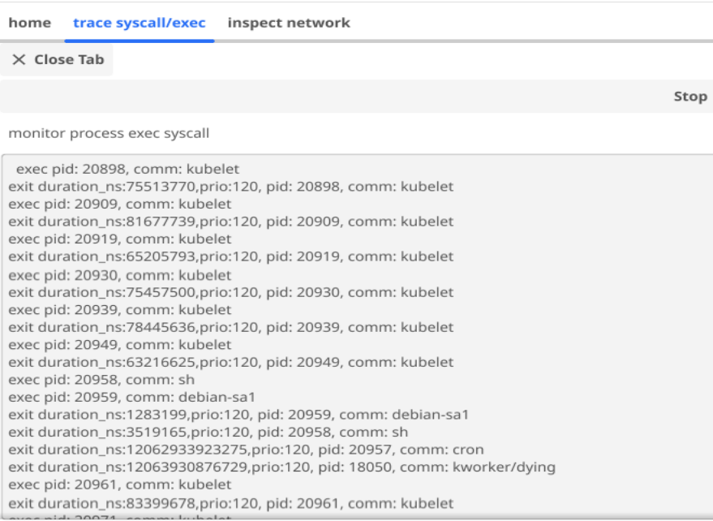
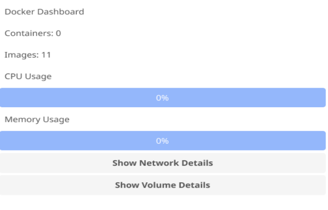
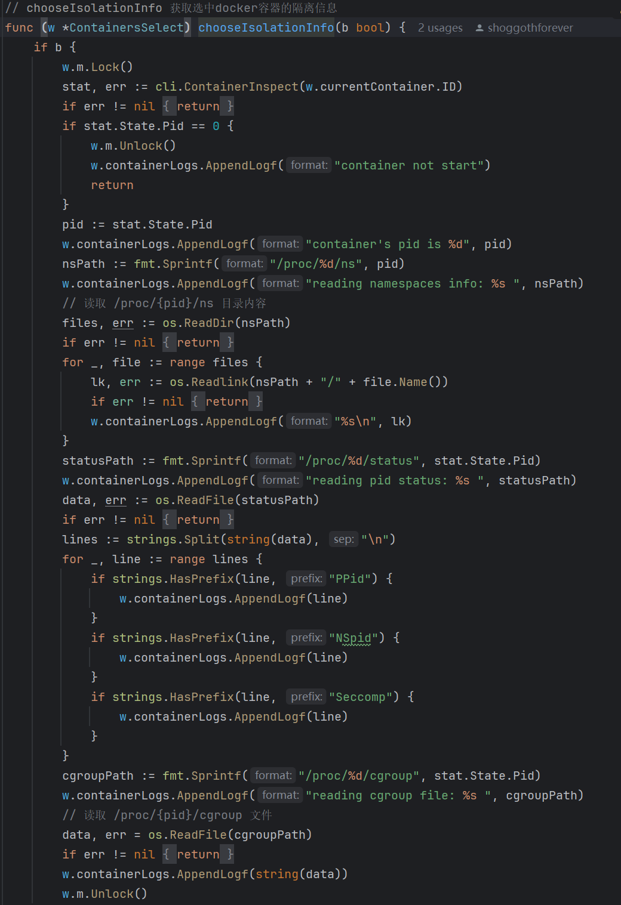
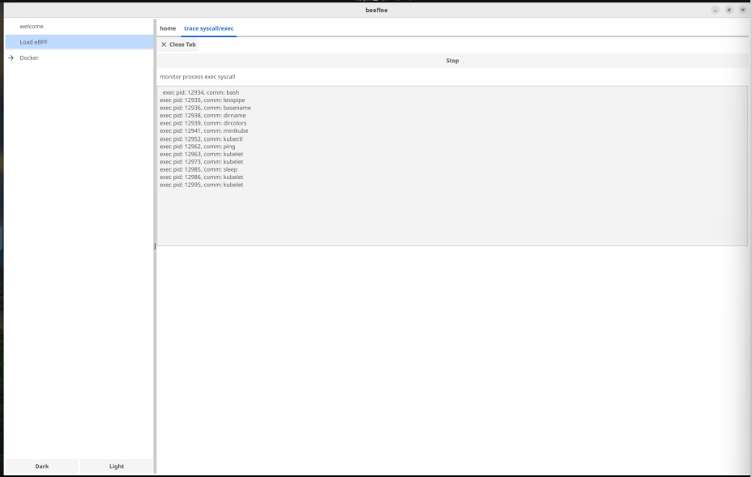
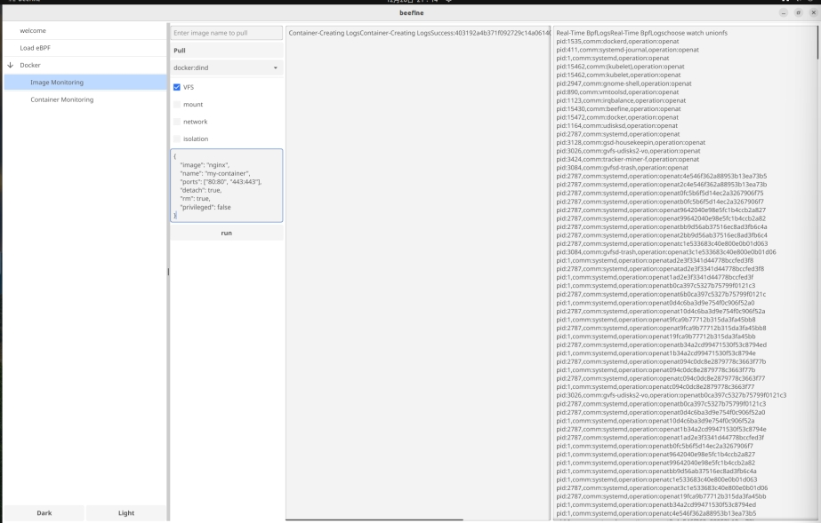
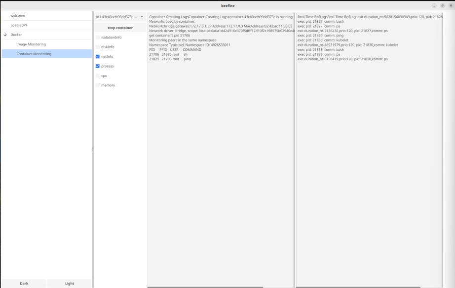

# 概述
## 项目背景
随着容器化技术在现代软件开发和部署中的广泛应用，Docker 作为其代表性工具，已经成为开发者和运维人员的核心选择。然而，尽管容器技术极大地简化了应用的部署和管理，许多开发者对容器创建过程中的底层机制仍缺乏深入了解。例如，操作系统在处理镜像解压、文件系统挂载、网络隔离等关键步骤时的具体实现细节，往往不为人知。此外，随着 Docker Swarm 和 Kubernetes 等容器编排系统的普及，应用系统中的容器数量急剧增加，理解单个 Pod 中容器的通信方式和最小单元显得尤为重要。

为了填补这一空白，Beefine 项目应运而生。

## 项目简介
Beefine 是一个基于 Fyne 和 Cilium eBPF 框架开发的工具，旨在通过图形化交互界面（GUI）实时监控 Docker 容器的创建过程，帮助用户深入理解虚拟化技术的核心理念和实现原理。项目不仅支持加载和管理 eBPF 程序，追踪操作系统在 Docker 操作中的行为，还计划在未来扩展到 Kubernetes 集群的 Pod 监控，为用户提供更加全面的容器化技术洞察。

Beefine 通过 eBPF 技术捕获和分析容器的系统调用行为，并借助 Fyne 提供图形化的实时反馈，最终实现以下目标：

简化学习过程：通过实时观测容器创建过程，帮助开发者更好地理解容器镜像，虚拟化技术。

提高可视化交互体验： 提供直观的图形界面，展示关键的系统行为和资源变化；配置了动态加载bpf程序的入口，让使用者快速实践bpf。

开发工具化：为学习者和工程师提供一个可以随时实验和验证的工具，减少操作系统实验的门槛。

## 项目应用场景
该项目目前专注于实时观测场景：

观测Docker容器的创建：Beefine 通过实时加载 eBPF 程序，从而全面捕捉 Docker 使用镜像创建容器时的操作系统行为。通过详细记录和分析在容器创建过程中的镜像拉取、文件系统设置、命名空间管理和网络配置等多个关键步骤，Beefine 为学习者和开发者提供了一个能够帮助他们深入理解容器核心机制的实验环境，从而提升其对容器技术的掌握和应用能力。

观测Docker容器的运行：在容器运行阶段，Beefine 实时展示容器所处的命名空间（namespace）和控制组（cgroup）信息，并允许用户进行相应的设置。通过动态加载 XDP 程序，有效管理和分析容器网络中的数据包，确保网络通信的高效与安全。同时还支持动态观测容器内的进程信息，使用户能够实时监控容器内运行的各类进程，及时发现和解决潜在的问题，从而优化容器的运行性能和稳定性。

管理动态 eBPF 程序：Beefine 提供了一个直观的界面，允许用户轻松加载和管理 eBPF 程序，使得用户能够根据具体需求动态分析系统行为，灵活应对不同的监控和调试场景。通过简化 eBPF 程序的管理过程，Beefine 大大提升了用户在系统行为分析和性能调优方面的效率，使开发者和运维人员能够更加专注于核心任务，减少了复杂配置和操作的时间成本。

# 项目开发进度
### 已实现功能

1. **Docker 创建过程观测**：
    - 使用 eBPF 追踪操作系统调用，捕获 Docker 使用镜像创建容器的全过程。
2. **图形化界面**：
    - 使用 Fyne 开发可交互的 GUI，包括日志查看、动态程序加载等功能。
3. **实时 eBPF 程序加载**：
    - 支持用户加载自定义 eBPF 程序，动态分析特定行为。

### 待开发功能

1. **Kubernetes 集群观测**：
    - 设计用于追踪 Kubernetes Pod 调度与运行的功能模块。
2. **镜像与容器的性能分析**：
    - 提供更多统计功能，分析资源使用情况（CPU、内存、I/O 等）。
3. **历史数据管理**：
    - 支持保存和回放观测结果，便于后续分析。
4. **优化 GUI**：
    - 增加更多交互功能，例如高级过滤、实时图表更新。

### 当前开发进度
1. **功能模块**:
    - [X]  易于使用且可交互的bpf载入界面，基于golang的UI库fyne客制化了通用组件，实现了很好的复用性
    - [X]  提供模板化的框架式bpf编程体验，便于使用者轻松编写自己的bpf程序，减轻搭建系统环境的负担，支持动态加载 eBPF 程序，结合客制化的组件可以快速看到运行结果
    - [X]  聚合基础的docker cli功能（镜像拉取、容器创建、状态展示），并且提供基础的 Docker 对象观测功能（可选加载bpf程序实时分析容器创建与运行中的系统调用、文件系统操作、网络传输、隔离控制的信息）
    - [ ]  结合prometheus以及echarts等组件实现更加完善的docker container内部负载观测视图
    - [ ]  使观测程序不局限于操作系统，实现即使不原生支持bpf技术的操作系统也可以通过远程连接的方式观测远程服务器中的容器情况
    - [ ]  自动化压测测试案例设计
2. **Docker观测重点**:
- Docker 使用镜像创建容器的全过程:
    - [X] 镜像文件的拉取与解压
    - [X] 读取解析镜像文件结构打包成runtime bundle(VFS)
    - [X] 基于xdp提取从网络中获取镜像信息的数据包
    - [X] 文件系统的挂载（mount）
    - [X] 容器隔离环境的设置（Namespace 和 Cgroup）

- Docker 容器运行中的性能观测
    - [X] 隔离文件信息
    - [X] 挂载磁盘信息
    - [X] 隔离在相同命名空间下的进程，网络信息
    - [X] cpu信息
    - [X] memory信息
    - [ ] 补充提取其它命名空间下信息的功能
    - [ ] 对容器的namespace和cgroup等等隔离机制的交互式改造

3 后续计划扩展到更多场景，包括
- [ ] 对docker底层containerd，runc，docker-shim添加更细致的观测功能
- [ ] Kubernetes 集群中的pod行为观测
- [ ] 日志数据存盘回放功能

# 整体框架及功能模块设计
项目整体UI设计较为简约，目前共有tab分页式设计，tree目录式设计，采用了一致的编码风格，之后介绍的每个功能模块都是由内核bpf模块，用户应用模块和ui模块三者结合实现的
## UI模块
整体采用golang的fyne框架实现，使用了许多可以复用的自定义组件，每种组件有统一的map定位，保证不重复创建页面造成资源浪费，代码按照golang的package隔离规则采用了每个package的组件独立管理的模式，有全局的资源管理者管控着每个package下的独立组件，各package间组件隔离互不干扰

全局的目录树结构管理视图，采用两个map表示节点之间的连接关系，以此作为fyne库创建目录树的依据，各个创建视图的Screen函数按package相互隔离，易于管理

全局的页面管理者，内部的子页面按package隔离

其余自定义组件见pkg/component目录

## bpf内核模块
包含了基础的bpf内核（c程序实现）和用户态程序（go程序实现），可以供使用者载入，了解ebpf程序的运行效果
### 基于cilium/bpf2go && libbpf 
涉及到的bpf hook以及相关程序:
- 展示系统中可用的bpf帮助函数，为初学者提供开发上的帮助
- 选择网卡接口，实时获取经过网卡的数据计数，并展示部分报文信息
  
xdp程序源码展示：自底向上拆解网络包，得到udp/tcp报文，转换得到具体的报文首部数据结构，提取其中信息
  
- 载入ebpf程序监测系统中的exec系统调用，在入口和出口处都设置了钩子函数，实时展示系统中运行和退出的程序
  
bpf程序源码展示：利用bpf帮助函数获取到必要的pid，命令信息，以及程序task struct，通过bpf map得到用户态传入的container‘s pid(即容器启动后开启的sh/bash的pid)，进而过滤掉容器外的进程信息
  
  
- tracepoint/syscalls/sys_enter_mount
  
- tracepoint/syscalls/sys_enter_openat
- tracepoint/syscalls/sys_enter_read
  
### 基于bpftrace脚本（scripts目录下）
bpftrace工具是一个提供了使用一行代码即可启动bpf程序的辅助工具，它也自实现了bpftrace脚本语言，也是在bpftrace工具的帮助下，我们在短时间内实现了大量hook函数
涉及hook点：
- tracepoint:syscalls:sys_enter_clone
- tracepoint:syscalls:sys_enter_unshare
- tracepoint:syscalls:sys_enter_setns
- tracepoint:syscalls:sys_enter_seccomp
- tracepoint:syscalls:sys_enter_prctl
- tracepoint:cgroup:cgroup_attach_task
- tracepoint:syscalls:sys_enter_socket
- tracepoint:syscalls:sys_enter_bind
- tracepoint:syscalls:sys_enter_listen
- tracepoint:syscalls:sys_enter_accept
- tracepoint:syscalls:sys_enter_connect
- tracepoint:syscalls:sys_enter_epoll_create
- kprobe:tcp_connect
   
  观测tcp连接建立的过程状态
  
### 用户态程序
统一的模板，需由用户自行定义载入bpf程序时需要的请求结构体，从bpf程序输出pipe中得到的响应结构体，利用bpf2go工具链一键创建相关bpf用户态加载函数，bpf数据结构交互功能，采用闭包的形式创建了具有只执行一次语义的清理函数的构造函数，保证了每个bpf程序都能够正常退出

docker cli管理模块
在docker cli基础上再次封装，实现了在应用程序中运行docker容器，管理容器状态，管理与docker daemon的连接复用

## 功能模块
### Docker DashBoard
展示系统中的docker daemon实时的使用情况，提供功能便于使用者了解docker运行的整体情况
**实现重点**:获取系统中的容器和镜像数量，以及统计所有运行中的容器对系统cpu和memory资源的使用情况

### Docker-image monitor模块

该模块聚焦于观测docker基于image创建容器的全过程，聚合了docker 对image的管理能力，可以输入image name 拉取image，拉取选择系统中存在的镜像，右侧的看板会展示当前镜像创建的过程日志
**实现重点**:
通过日志还原docker解析image创建容器的过程，需要完全掌握docker解析镜像的过程，了解docker底层的实现原理，镜像解析的过程:镜像格式遵守OCI镜像规范定义，包含镜像索引，镜像清单，镜像层以及镜像配置。镜像索引用以区分镜像的不同架构平台，镜像清单中包含了镜像具体内容的哈希摘要，提供了获取镜像的寻址方式，提取镜像层信息的方法，因此主要涉及的系统调用就是openat，read，write等fs接口，docker的容器文件系统采用的是unionfs，容器最初只有一层rootfs，解析镜像层文件中的每一层都会往rootfs上覆盖新的一层，而镜像配置则主要包含了镜像中的环境变量，执行参数，存储卷等信息，docker会通过镜像配置中的内容得到对应的OCI runtime bundle启动容器
使用fyne组件实现bpf程序的交互式加载

以观测文件系统为例，选择加载程序后就会调用bpf模块的启动函数，得到数据的输出管道，该组件也会集中管理bpf程序的关闭函数，保证程序能够安全卸载关闭

### Docker-container monitor模块

该模块聚焦于运行中的容器的实时数据分析，OCI运行时规范规定了容器的运行状态，该模块主要观测的是处于stopped和running状态的容器，对于running状态的容器可以观测到更多有关的数据，容器本身的隔离使用了namespace和cgroup等等linux 容器技术，docker 则是通过容器运行时来管理容器
**实现重点**:分析容器的namespace以及cgroup信息，分析处在隔离中的容器的进程，网络等细节
对于container也是同理

略有不同的是，部分信息可以不通过bpf程序，直接可以从系统文件中读取到
获取隔离信息

获取与容器处于同一命名空间下的所有进程信息

# 项目创新点
1. 项目客制化了多个可复用的UI，配备了快速生成bpf程序框架的脚本，支持使用脚本一键创建bpf程序模板，具有较强的拓展性，可以用于实验目的快速添加自定义的bpf程序并快速校验
2. 对于加载bpf程序的设计，结合了cilium库，libbpf以及bpftrace等工具，结合golang天然支持并发的特性，抽象出了一套并发加载bpf程序的框架，所有bpf程序都基于该框架设计，也实现了UI模块，应用模块和内核模块之间的高内聚，低耦合
3. 在限制了可以获取的函数参数信息的条件下编写能够通过bpf verifier的bpf c程序，然后结合golang的bpf辅助库实现了一键载入bpf程序，并且通过bpf map、perf、ringbuffer等数据结构实现内核态和用户态的数据交互，再结合golang 的UI库搭建了可交互的桌面端程序，把底层的细节对用户隐藏，只展示用户需要的数据
4. 通过日志还原docker解析image创建容器的完整视图，便于使用者快速理解docker解析镜像的过程，了解docker底层的实现原理，镜像解析的过程，理解OCI镜像规范定义，包含镜像索引，镜像清单，镜像层以及镜像配置。
5. 实现对VFS，挂载，网络和隔离api的bpf观测程序交互式地载入策略，可以允许使用者按需获取镜像加载数据
6. 基于linux文件系统的设计结构，通过系统内部程序实现了实时获取同一namespace中的peer信息，以pid namespace为例，实现了实时获取容器中新增运行进程信息的展示，减少容器外信息的干扰，其他的namespace空间也类似
7. 出于实验的用途，实验过程中的产生的一切容器及其它资源都会在程序结束时彻底回收，减少使用者的心智负担

# 项目测试与分析
## Load eBPF模块测试
点击应用左侧Load eBPF选项卡进入home界面
### ListHelpFunction功能测试
在home界面下点击ListHelpFunction按钮进入子界面，点击下拉选择框，选择syscall:选项，可发现应用展示出了syscall下的所有bpf帮助函数，同时支持复制等操作

点击Close Tab按钮返回home界面

### InspectNetwork功能测试
在home界面下点击InspectNetwork按钮进入InspectNetwork子界面，点击下拉选择框，选择想要追踪的网络，应用自动开始抓取数据报文。

打开终端，输入ping www.baidu.com 命令，发现应用显示出了数据包数量和部分报文数据，同时再进行定时数据更新。

点击Stop按钮，结束网络数据抓包，点击Close Tab按钮返回home界面

### TraceSyscall/Exec功能测试
在home界面下点击TraceSyscall/Exec按钮进入TraceSyscall/Exec子界面，应用自动开始抓取调用的系统调用。

打开终端，输入命令ping www.baidu.com 命令和sleep 10命令，发现应用中已经有若干条系统调用被展示出来

点击Stop按钮，结束系统调用抓包，点击Close Tab按钮返回home界面

## Docker模块测试
点击应用左侧Docker选项卡，展开Docker模块功能，同事应用进入DockerDashboard界面，展示系统中的容器和镜像数量，以及统计所有运行中的容器对系统cpu和memory资源的使用情况

### ImageMonitoring功能测试
点击应用左侧ImageMonitoring选项卡，进入ImageMonitoring子界面，点击SelectExistedImage下拉选项框，选择docker:dind，选择想要显示的信息，选中对应复选框，点击Run按钮，即可创建一个Docker
返回DockerDashboard界面，发现新创建的Docker已被显示出来

### ContainerMonitoring功能测试
点击应用左侧ContainerMonitoring选项卡，进入ContainerMonitoring子界面，点击下拉选择框，选中一个正在运行的容器，在终端中进入这个容器的交互式Shell，选中任意复选框，可在左侧输出框中输出可复制的容器的相关信息；选中netinfo和process复选框，在终端进入容器输入相关命令（例如ping命令），应用右侧输出框输出相关信息

# 项目管理与团队管理

# 总结与展望
本项目自立项到目前已有一个多月的时间，在这一个多月的时间里，团队共向gitlab仓库推送50余次，更新文档10余版，通过该项目，团队对eBPF的了解与掌握程度有了可观的提升。值得欣慰的是，本项目圆满完成了立项时所预定的目标，在简化学习过程、提高可视化交互体验、开发工具化等方面取得了预期成果，同时，通过规范化编程，我们设置了许多可拓展模块，使用者可根据自身学习情况定制化自己的软件体验，这无疑有助于未来的操作系统教学与实践。See Unknown，Conquer Unknown，我们很开心能够为这一空白添砖加瓦。

在Beefine的开发过程中，我们参考了许多优秀的开源项目，例如cilium，libbpf，eunomia-bpf，在这里，谨向这些伟大的开发团队表达我们诚挚的感谢。

一个月的时间可以成熟一个人的技术，但绝不会让一个应用变得完美。在未来，团队还将致力于丰富优化本项目，例如增加对Kubernetes的支持、引入实时性能监控、对远程主机的支持、优化可视化体验，引入实时更新图表与分析报告以及对Windows、MacOS的支持和对OpenEuler等国产操作系统的专门优化，
# 参考文献与项目
[ebpf开发教程 eunomia-bpf](https://github.com/eunomia-bpf/bpf-developer-tutorial/tree/main)\
[eXpress Data Path program written tutor](https://github.com/xdp-project/xdp-tutorial/tree/master)\
[bpf程序代码风格参考-1 cilium](https://github.com/cilium/cilium/tree/main/bpf)\
[bpf程序代码风格参考-2 linux源码中的bpf程序以及linux源码](https://elixir.bootlin.com/linux/v6.11.5/source/samples/bpf)\
[基于libbpf的bpf程序编程入门 libbpf-bootstrap](https://github.com/libbpf/libbpf-bootstrap/tree/master/examples)\
[libbpf-api](https://libbpf.readthedocs.io/en/latest/api.html)\
[fyne图形界面设计参考](https://github.com/fyne-io/fyne/tree/master/cmd/fyne_demo)\
[cilium框架官方文档](https://docs.cilium.io/en/stable/network/clustermesh/)\
[bpf verifier rules](https://www.kernel.org/doc/html/latest/bpf/verifier.html)\
[ebpf可视化项目参考](https://github.com/linuxkerneltravel/lmp/tree/develop/eBPF_Visualization)\
[bpftrace 脚本参考](https://github.com/bpftrace/bpftrace/tree/master/tools)
